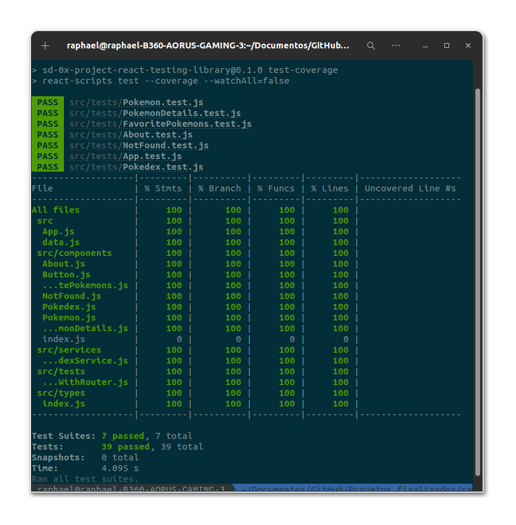
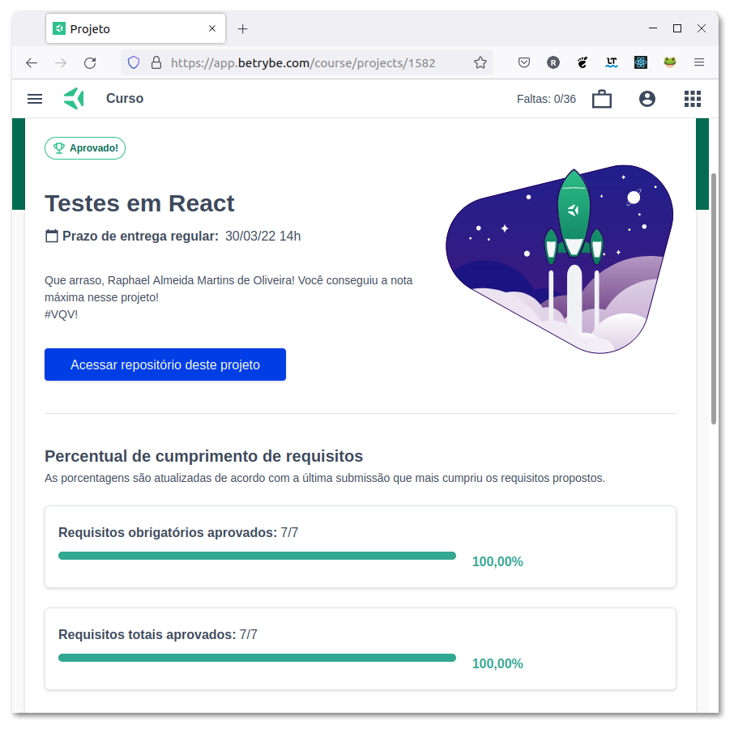

# :test_tube: Tests with React Testing Library  :alembic:

## :page_with_curl: About

React testing project developed by [Raphael Martins](https://www.linkedin.com/in/raphaelameidamartins/) at the end of Unit 14 ([Front-end Development Module](https://github.com/raphaelalmeidamartins/trybe_exercicios/tree/main/2_Desenvolvimento-Front-end)) of Trybe's Web Development course. I was approved with 100% of the mandatory and optional requirements met.

We had to implement integration and unit tests with React Testing Library to a React project that was already developed.

## :man_technologist: Developed Skills

* Implement integration and unit tests to a React application by using React Testing Library

## :hammer_and_wrench: Tools

* React.js
* React Testing Library (RTL)
* Jest.js
* Stryker Mutator
* JavaScript ES6+

## Installation

### **1 -** Clone the repository

```sh
git clone git@github.com:raphaelalmeidamartins/react-testing-library.git
```

### **2 -** Enter the project folder

```sh
cd react-testing-library
```

### **3 -** Install the dependencies

```sh
npm install
```

### **4 -** Check the tests coverage

```sh
npm run test-coverage
```

### **5 -** Check the Stryker Mutator tests

The Stryker files can be found at `./stryker/`

```sh
npx stryker run <path-to-file>
```

## :test_tube: Tests coverage



## :trophy: Grade



### :copyright: Copyright disclaimer

I developed this project for learning purposes, all the tests code and documentation texts in Portuguese and English are my authorship, and the rights belong exclusively to me. It is allowed to download or clone the repository for study purposes. However, it is not allowed to publish full or partial copies. This disclaimer does not cover libraries and dependencies, which are subject to their respective licenses. It also does not cover the React application to be tested, which was already developed by Trybe.
